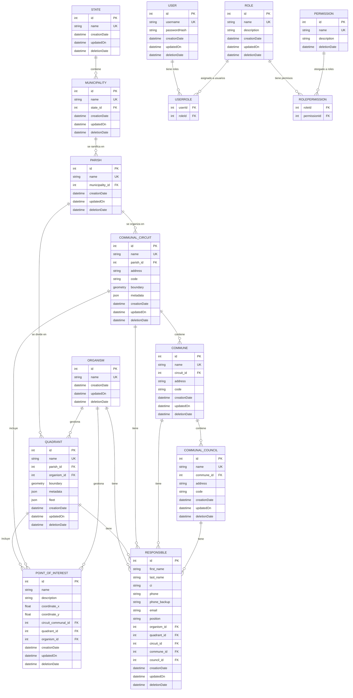

# Sistema de Administración Geoespacial – Backend

## Descripción General

Este backend es un sistema integral de administración geoespacial construido con **Node.js**, **Express**, **TypeScript**, y **Sequelize ORM**. Gestiona divisiones administrativas geográficas jerárquicas (Estados → Municipios → Parroquias) y sus subdivisiones espaciales (Cuadrantes y Circuitos Comunales), junto con Puntos de Interés que pueden asociarse espacialmente con estas entidades. El sistema está diseñado para trabajar perfectamente con **Leaflet** para visualización interactiva de mapas e interacción con datos geoespaciales. Cuenta con control de acceso basado en roles (RBAC), autenticación JWT y registro de auditoría integral.

### Características Principales

- **Operaciones CRUD Completas** para entidades geográficas (estados, municipios, parroquias, cuadrantes, circuitos comunales, puntos de interés), usuarios, roles y permisos
- **Gestión de Datos Espaciales** con límites de geometría e indexación espacial optimizada para integración con Leaflet
- **Salida GeoJSON Compatible con Leaflet** para visualización de mapas sin problemas
- **Asociación Espacial Automática** de Puntos de Interés con Cuadrantes y Circuitos Comunales basada en coordenadas
- **Control de Acceso Basado en Roles (RBAC)** con permisos generados automáticamente
- **Autenticación JWT** con hash de contraseñas bcrypt
- **Registro de Auditoría Integral** con seguimiento de cambios a nivel de campo
- **Soporte Multi-Base de Datos** (PostgreSQL/SQLite)
- **API RESTful** con paginación, filtrado y ordenamiento
- **TypeScript** para seguridad de tipos y mejor experiencia de desarrollo

### Stack Tecnológico

**Dependencias Principales:**

- **Node.js** con framework **Express**
- **TypeScript** para seguridad de tipos
- **Sequelize** con **sequelize-typescript** para ORM
- **PostgreSQL** con **PostGIS** (producción) / **SQLite** (pruebas)
- **JWT** para autenticación
- **bcrypt** para hash de contraseñas
- **CORS** para compartir recursos entre orígenes

**Integración Geoespacial:**

- **PostGIS** para operaciones de base de datos espaciales
- Soporte de formato **GeoJSON** para compatibilidad con Leaflet
- **Indexación espacial** para consultas de datos de mapas optimizadas

**Herramientas de Desarrollo:**

- **ESLint** con soporte para TypeScript
- **Prettier** para formateo de código
- **ts-node-dev** para recarga en caliente durante desarrollo
- **Supertest** para pruebas de API

## Instalación y Configuración

### Prerrequisitos

- **Node.js** (v16 o superior)
- Gestor de paquetes **Yarn**
- **PostgreSQL** (para producción) o **SQLite** (para pruebas)

### Variables de Entorno

Crea un archivo `.env` en el directorio backend con las siguientes variables:

```env
# Configuración de Base de Datos
DB_DIALECT=postgres          # o 'sqlite' para pruebas
DB_HOST=localhost
DB_PORT=5432
DB_NAME=geospatial_admin
DB_USER=your_username
DB_PASSWORD=your_password
DB_STORAGE=:memory:          # Solo para pruebas SQLite

# Configuración JWT
JWT_SECRET=your-super-secret-jwt-key
JWT_EXPIRE_TIME=1h           # Tiempo de expiración del token

# Configuración del Servidor
PORT=4000
BASE_URL=localhost
CORS_ORIGIN=http://localhost:3000

# Entorno
NODE_ENV=development         # o 'production' o 'test'
```

### Pasos de Instalación

1. **Instalar dependencias:**

   ```bash
   yarn install
   ```

2. **Configurar tu base de datos** (PostgreSQL para producción)

3. **Poblar la base de datos con usuario administrador y permisos:**

   ```bash
   yarn db:populate
   ```

4. **Iniciar el servidor de desarrollo:**
   ```bash
   yarn dev
   ```

El servidor se iniciará en `http://localhost:4000` (o tu PORT configurado).

## Scripts Disponibles

- **`yarn dev`** - Iniciar servidor de desarrollo con recarga en caliente usando ts-node-dev
- **`yarn start`** - Iniciar servidor de producción
- **`yarn db:populate`** - Sembrar base de datos con usuario administrador y todos los permisos
- **`yarn db:clear`** - Limpiar todos los datos de la base de datos
- **`yarn test`** - Ejecutar suite de pruebas Jest con salida detallada
- **`yarn lint`** - Ejecutar ESLint con auto-corrección para archivos TypeScript

## Modelos de Base de Datos y Esquema

### Modelos Principales

#### **User**

- `id`: integer, PK, auto-increment
- `username`: string, requerido, único
- `passwordHash`: string, requerido (hash bcrypt, excluido de consultas por defecto)
- `creationDate`: datetime, automático
- `updatedOn`: datetime, automático
- `deletionDate`: datetime, nullable (eliminación suave)
- **Relaciones**: Muchos-a-muchos con Role vía UserRole
- **Hooks**: Hash de contraseña antes de guardar

#### **Role**

- `id`: integer, PK, auto-increment
- `name`: string, requerido, único
- `description`: string, opcional
- `creationDate`: datetime, automático
- `updatedOn`: datetime, automático
- `deletionDate`: datetime, nullable (eliminación suave)
- **Relaciones**: Muchos-a-muchos con User y Permission
- **Hooks**: Previene eliminación si hay usuarios asignados

#### **Permission**

- `id`: integer, PK, auto-increment
- `name`: string, requerido, único
- `description`: string, requerido
- `deletionDate`: datetime, nullable (eliminación suave)
- **Relaciones**: Muchos-a-muchos con Role vía RolePermission
- **Auto-Generados**: Permisos para entidades (create/get/edit/delete para cada entidad)

#### **State**

- `id`: integer, PK, auto-increment
- `name`: string, requerido, único
- `creationDate`: datetime, automático
- `updatedOn`: datetime, automático
- `deletionDate`: datetime, nullable (eliminación suave)
- **Relaciones**: Tiene muchos Municipalities
- **Hooks**: Previene eliminación si hay municipios asignados

#### **Municipality**

- `id`: integer, PK, auto-increment
- `name`: string, requerido, único
- `state_id`: FK a State, requerido
- `creationDate`: datetime, automático
- `updatedOn`: datetime, automático
- `deletionDate`: datetime, nullable (eliminación suave)
- **Relaciones**: Pertenece a State, tiene muchas Parishes
- **Hooks**: Previene eliminación si hay parroquias asignadas

#### **Parish**

- `id`: integer, PK, auto-increment
- `name`: string, requerido, único
- `municipality_id`: FK a Municipality, requerido
- `creationDate`: datetime, automático
- `updatedOn`: datetime, automático
- `deletionDate`: datetime, nullable (eliminación suave)
- **Relaciones**: Pertenece a Municipality, tiene muchos Quadrants y Communal Circuits
- **Hooks**: Previene eliminación si hay cuadrantes o circuitos asignados

#### **Quadrant**

- `id`: integer, PK, auto-increment
- `name`: string, requerido, único
- `parish_id`: FK a Parish, requerido
- `organism_id`: FK a Organism, requerido
- `boundary`: geometry, requerido (datos espaciales que definen los límites del cuadrante)
- `metadata`: JSON, opcional (información adicional del cuadrante)
- `fleet`: JSON, requerido (datos de gestión de flota con estructura abajo)
  - `small`: objeto con `active` (integer, por defecto 0, no negativo) e `inactive` (integer, por defecto 0, no negativo)
  - `big`: objeto con `active` (integer, por defecto 0, no negativo) e `inactive` (integer, por defecto 0, no negativo)
  - `bike`: objeto con `active` (integer, por defecto 0, no negativo) e `inactive` (integer, por defecto 0, no negativo)
- `creationDate`: datetime, automático
- `updatedOn`: datetime, automático
- `deletionDate`: datetime, nullable (eliminación suave)
- **Relaciones**: Pertenece a Parish, pertenece a Organism, tiene muchos Points of Interest, tiene muchos Responsibles
- **Índice Espacial**: Recomendado en el campo boundary para rendimiento
- **Validación**: Los números de flota deben ser enteros no negativos

#### **Communal Circuit**

- `id`: integer, PK, auto-increment
- `name`: string, requerido, único
- `parish_id`: FK a Parish, requerido
- `address`: string, requerido (dirección de oficina, diferente de la geometría)
- `code`: string, requerido (código de identificación del circuito)
- `boundary`: geometry, requerido (datos espaciales que definen los límites del circuito)
- `metadata`: JSON, opcional (información adicional del circuito)
- `creationDate`: datetime, automático
- `updatedOn`: datetime, automático
- `deletionDate`: datetime, nullable (eliminación suave)
- **Relaciones**: Pertenece a Parish, tiene muchos Points of Interest, tiene muchos Responsibles, tiene muchas Communes
- **Índice Espacial**: Recomendado en el campo boundary para rendimiento

#### **Commune**

- `id`: integer, PK, auto-increment
- `name`: string, requerido, único
- `circuit_id`: FK a Communal Circuit, requerido
- `address`: string, requerido (dirección de oficina de la comuna)
- `code`: string, requerido (código de identificación de la comuna)
- `creationDate`: datetime, automático
- `updatedOn`: datetime, automático
- `deletionDate`: datetime, nullable (eliminación suave)
- **Relaciones**: Pertenece a Communal Circuit, tiene muchos Responsibles, tiene muchos Communal Councils
- **Hooks**: Previene eliminación si hay consejos comunales asignados

#### **Communal Council**

- `id`: integer, PK, auto-increment
- `name`: string, requerido, único
- `commune_id`: FK a Commune, requerido
- `address`: string, requerido (dirección de oficina del consejo)
- `code`: string, requerido (código de identificación del consejo)
- `creationDate`: datetime, automático
- `updatedOn`: datetime, automático
- `deletionDate`: datetime, nullable (eliminación suave)
- **Relaciones**: Pertenece a Commune, tiene muchos Responsibles
- **Hooks**: Previene eliminación si hay responsables asignados

#### **Point of Interest**

- `id`: integer, PK, auto-increment
- `name`: string, requerido
- `description`: string, opcional
- `coordinate_x`: float, requerido (longitud)
- `coordinate_y`: float, requerido (latitud)
- `circuit_communal_id`: FK a Communal Circuit, opcional (auto-asignado basado en coordenadas)
- `quadrant_id`: FK a Quadrant, opcional (auto-asignado basado en coordenadas)
- `organism_id`: FK a Organism, opcional
- `creationDate`: datetime, automático
- `updatedOn`: datetime, automático
- `deletionDate`: datetime, nullable (eliminación suave)
- **Relaciones**: Pertenece a Quadrant (opcional), Communal Circuit (opcional), y Organism (opcional)
- **Lógica de Negocio**: Automáticamente asociado con Quadrant y/o Communal Circuit si las coordenadas caen dentro de sus límites
- **Hooks**: Lógica de asociación espacial en crear/actualizar

#### **Organism**

- `id`: integer, PK, auto-increment
- `name`: string, requerido, único
- `creationDate`: datetime, automático
- `updatedOn`: datetime, automático
- `deletionDate`: datetime, nullable (eliminación suave)
- **Relaciones**: Tiene muchos Points of Interest, tiene muchos Responsibles
- **Hooks**: Previene eliminación si hay puntos de interés o responsables asignados

#### **Responsible**

- `id`: integer, PK, auto-increment
- `first_name`: string, requerido
- `last_name`: string, requerido
- `ci`: string, requerido (formato de cédula venezolana: letra mayúscula seguida de números)
- `phone`: string, requerido (validación de formato de número telefónico venezolano)
- `phone_backup`: string, opcional (validación de formato de número telefónico venezolano)
- `email`: string, opcional (validación de formato de email)
- `position`: string, requerido
- `organism_id`: FK a Organism, opcional
- `quadrant_id`: FK a Quadrant, opcional
- `circuit_id`: FK a Communal Circuit, opcional
- `commune_id`: FK a Commune, opcional
- `council_id`: FK a Communal Council, opcional
- `creationDate`: datetime, automático
- `updatedOn`: datetime, automático
- `deletionDate`: datetime, nullable (eliminación suave)
- **Relaciones**: Pertenece a Organism (opcional), Quadrant (opcional), Communal Circuit (opcional), Commune (opcional), Communal Council (opcional)
- **Validación**:
  - Los números de teléfono deben coincidir con el formato venezolano (regex: `^0[24]\d{2}-\d{7}$` para fijos o `^04(12|14|16|22|24|26)-\d{7}$` para móviles)
  - La cédula debe comenzar con letra mayúscula seguida de números
  - El email debe tener formato válido si se proporciona
- **Hooks**: Registro automático de cambios en todas las operaciones

### Modelos de Unión (Muchos-a-Muchos)

#### **UserRole**

- `userId`: FK a User
- `roleId`: FK a Role
- **Hooks**: Registro automático de enlace/desenlace para rastro de auditoría

#### **RolePermission**

- `roleId`: FK a Role
- `permissionId`: FK a Permission
- **Hooks**: Registro automático de enlace/desenlace para rastro de auditoría

### Relaciones de Entidades



**Detalles de Relaciones:**

- **User** ↔ **Role** (muchos-a-muchos vía tabla de unión UserRole)
- **Role** ↔ **Permission** (muchos-a-muchos vía tabla de unión RolePermission)
- **State** → **Municipality** (uno-a-muchos - los estados contienen múltiples municipios)
- **Municipality** → **Parish** (uno-a-muchos - los municipios se ramifican en múltiples parroquias)
- **Parish** → **Quadrant** (uno-a-muchos - las parroquias se dividen en múltiples cuadrantes)
- **Parish** → **Communal Circuit** (uno-a-muchos - las parroquias se organizan en múltiples circuitos comunales)
- **Communal Circuit** → **Commune** (uno-a-muchos - los circuitos contienen múltiples comunas)
- **Commune** → **Communal Council** (uno-a-muchos - las comunas contienen múltiples consejos)
- **Organism** → **Quadrant** (uno-a-muchos - los organismos gestionan múltiples cuadrantes)
- **Quadrant** → **Point of Interest** (uno-a-muchos, opcional - los puntos pueden estar dentro de los límites del cuadrante)
- **Communal Circuit** → **Point of Interest** (uno-a-muchos, opcional - los puntos pueden estar dentro de los límites del circuito)
- **Organism** → **Point of Interest** (uno-a-muchos, opcional - los organismos pueden gestionar múltiples puntos de interés)
- **Organism** → **Responsible** (uno-a-muchos, opcional - los organismos pueden tener múltiples personas responsables)
- **Quadrant** → **Responsible** (uno-a-muchos, opcional - los cuadrantes pueden tener múltiples personas responsables)
- **Communal Circuit** → **Responsible** (uno-a-muchos, opcional - los circuitos pueden tener múltiples personas responsables)
- **Commune** → **Responsible** (uno-a-muchos, opcional - las comunas pueden tener múltiples personas responsables)
- **Communal Council** → **Responsible** (uno-a-muchos, opcional - los consejos pueden tener múltiples personas responsables)

**Relaciones Espaciales:**

- Los Puntos de Interés se asocian automáticamente con Cuadrantes y Circuitos Comunales basado en la inclusión de coordenadas dentro de sus geometrías de límites
- Los índices espaciales en campos de límites optimizan el rendimiento de consultas espaciales

## Autenticación y Autorización

### Autenticación JWT

- **Generación de Tokens**: Tokens JWT con expiración configurable (por defecto: 1h)
- **Seguridad de Contraseñas**: Hash bcrypt con rondas de sal (por defecto: 10)
- **Validación de Tokens**: Middleware valida tokens en rutas protegidas
- **Contexto de Usuario**: ID de usuario autenticado disponible en `req.userId`

### Control de Acceso Basado en Roles (RBAC)

- **Permisos Auto-Generados**: 4 acciones × múltiples entidades
  - Acciones: `create`, `get`, `edit`, `delete`
  - Entidades: `state`, `municipality`, `parish`, `quadrant`, `communal_circuit`, `commune`, `communal_council`, `point_of_interest`, `organism`, `responsible`, `permission`, `role`, `user`
- **Rol de Administrador**: Creado automáticamente con todos los permisos
- **Usuario Administrador**: Credenciales por defecto (username: `admin`, password: `admin`)

### Rutas Protegidas

Todas las rutas excepto `/api/auth/*` requieren token JWT válido en el header Authorization:

```
Authorization: Bearer <your-jwt-token>
```

## Endpoints de API

### Rutas de Autenticación (`/api/auth`)

- **`POST /api/auth/login`** - Inicio de sesión de usuario con username/password
- **`GET /api/auth/validate`** - Validar token JWT
- **`GET /api/auth/me`** - Obtener información del usuario actual con roles y permisos

### Rutas Protegidas (Requieren Autenticación)

#### **Gestión de Usuarios**

- **`/api/users`** - Gestión de usuarios (operaciones CRUD)
- **`/api/roles`** - Gestión de roles con asignación de permisos
- **`/api/permissions`** - Listado y gestión de permisos

#### **Entidades Geográficas**

##### **States**

- **`GET /api/states`** - Listar todos los estados con paginación y filtrado
- **`POST /api/states`** - Crear un nuevo estado
- **`GET /api/states/:id`** - Obtener detalles específicos del estado
- **`PUT /api/states/:id`** - Actualizar un estado
- **`DELETE /api/states/:id`** - Eliminar un estado (eliminación suave)

##### **Municipalities**

- **`GET /api/municipalities`** - Listar municipios con relaciones de estado
- **`POST /api/municipalities`** - Crear un nuevo municipio
- **`GET /api/municipalities/:id`** - Obtener detalles específicos del municipio
- **`PUT /api/municipalities/:id`** - Actualizar un municipio
- **`DELETE /api/municipalities/:id`** - Eliminar un municipio (eliminación suave)

##### **Parishes**

- **`GET /api/parishes`** - Listar parroquias con relaciones de municipio
- **`POST /api/parishes`** - Crear una nueva parroquia
- **`GET /api/parishes/:id`** - Obtener detalles específicos de la parroquia
- **`PUT /api/parishes/:id`** - Actualizar una parroquia
- **`DELETE /api/parishes/:id`** - Eliminar una parroquia (eliminación suave)

##### **Quadrants**

- **`GET /api/quadrants`** - Listar cuadrantes con datos de límites espaciales (formato GeoJSON para Leaflet)
- **`GET /api/quadrants/geojson`** - Obtener todos los cuadrantes como GeoJSON FeatureCollection para consumo directo de Leaflet
- **`POST /api/quadrants`** - Crear un nuevo cuadrante (acepta geometría GeoJSON, procesa con indexación espacial)
- **`GET /api/quadrants/:id`** - Obtener detalles específicos del cuadrante incluyendo límites como GeoJSON
- **`GET /api/quadrants/:id/geojson`** - Obtener cuadrante específico como GeoJSON Feature
- **`PUT /api/quadrants/:id`** - Actualizar un cuadrante (acepta geometría GeoJSON para modificaciones de límites)
- **`DELETE /api/quadrants/:id`** - Eliminar un cuadrante (eliminación suave)

##### **Communal Circuits**

- **`GET /api/communal-circuits`** - Listar circuitos comunales con datos de límites espaciales (formato GeoJSON para Leaflet)
- **`GET /api/communal-circuits/geojson`** - Obtener todos los circuitos como GeoJSON FeatureCollection para consumo directo de Leaflet
- **`POST /api/communal-circuits`** - Crear un nuevo circuito comunal (acepta geometría GeoJSON)
- **`GET /api/communal-circuits/:id`** - Obtener detalles específicos del circuito incluyendo límites como GeoJSON
- **`GET /api/communal-circuits/:id/geojson`** - Obtener circuito específico como GeoJSON Feature
- **`PUT /api/communal-circuits/:id`** - Actualizar un circuito comunal (acepta geometría GeoJSON para modificaciones de límites)
- **`DELETE /api/communal-circuits/:id`** - Eliminar un circuito comunal (eliminación suave)

##### **Points of Interest**

- **`GET /api/points-of-interest`** - Listar puntos con opciones de filtrado espacial (por cuadrante/circuito, caja delimitadora)
- **`GET /api/points-of-interest/geojson`** - Obtener todos los puntos como GeoJSON FeatureCollection para marcadores de Leaflet
- **`GET /api/points-of-interest/within/:bounds`** - Obtener puntos dentro de los límites del viewport del mapa para carga dinámica
- **`POST /api/points-of-interest`** - Crear un nuevo punto (acepta lat/lng, asigna automáticamente a cuadrante/circuito)
- **`GET /api/points-of-interest/:id`** - Obtener detalles específicos del punto con asociaciones espaciales
- **`GET /api/points-of-interest/:id/geojson`** - Obtener punto específico como GeoJSON Feature
- **`PUT /api/points-of-interest/:id`** - Actualizar un punto (re-evalúa asociaciones espaciales si cambian las coordenadas)
- **`DELETE /api/points-of-interest/:id`** - Eliminar un punto de interés (eliminación suave)

##### **Organisms**

- **`GET /api/organisms`** - Listar todos los organismos con paginación y filtrado
- **`POST /api/organisms`** - Crear un nuevo organismo
- **`GET /api/organisms/:id`** - Obtener detalles específicos del organismo con puntos de interés y responsables asociados
- **`PUT /api/organisms/:id`** - Actualizar un organismo
- **`DELETE /api/organisms/:id`** - Eliminar un organismo (eliminación suave)

##### **Communes**

- **`GET /api/communes`** - Listar todas las comunas con paginación y filtrado
- **`POST /api/communes`** - Crear una nueva comuna
- **`GET /api/communes/:id`** - Obtener detalles específicos de la comuna con responsables y consejos asociados
- **`PUT /api/communes/:id`** - Actualizar una comuna
- **`DELETE /api/communes/:id`** - Eliminar una comuna (eliminación suave)

##### **Communal Councils**

- **`GET /api/communal-councils`** - Listar todos los consejos comunales con paginación y filtrado
- **`POST /api/communal-councils`** - Crear un nuevo consejo comunal
- **`GET /api/communal-councils/:id`** - Obtener detalles específicos del consejo con responsables asociados
- **`PUT /api/communal-councils/:id`** - Actualizar un consejo comunal
- **`DELETE /api/communal-councils/:id`** - Eliminar un consejo comunal (eliminación suave)

##### **Responsibles**

- **`GET /api/responsibles`** - Listar responsables con relaciones de entidades y filtrado
- **`POST /api/responsibles`** - Crear un nuevo responsable (valida formato de número telefónico venezolano y cédula)
- **`GET /api/responsibles/:id`** - Obtener detalles específicos del responsable
- **`PUT /api/responsibles/:id`** - Actualizar un responsable (valida formato de número telefónico y cédula)
- **`DELETE /api/responsibles/:id`** - Eliminar un responsable (eliminación suave)

### Características Comunes

- **Paginación**: `?page=1&pageSize=10`
- **Filtrado**: Filtros específicos de entidad (ej., `?name=search&parish=downtown`)
- **Filtrado Espacial**: Consultas de caja delimitadora (`?bbox=minLng,minLat,maxLng,maxLat`) para optimización del viewport del mapa
- **Ordenamiento**: `?sortBy=name&sortOrder=ASC`
- **Salida GeoJSON**: Todos los endpoints espaciales soportan formato GeoJSON para integración directa con Leaflet
- **Manejo de Errores**: Respuestas de error JSON consistentes
- **Validación**: Validación del cuerpo de la petición con mensajes de error detallados incluyendo validación de datos espaciales

## Configuración de Base de Datos

### Soporte Multi-Base de Datos

- **PostgreSQL con PostGIS**: Base de datos de producción con soporte JSONB y datos espaciales (extensión PostGIS requerida)
- **SQLite**: Base de datos de pruebas con opción en memoria
- **Basado en Entorno**: Configuración automática vía variables de entorno

### Operaciones de Base de Datos

- **Auto-Sync**: Sequelize automáticamente crea/actualiza tablas con columnas espaciales
- **Eliminaciones Suaves**: La mayoría de entidades usan `deletionDate` para eliminación suave
- **Restricciones**: Restricciones de clave foránea con políticas CASCADE/RESTRICT
- **Índices**: Indexación automática en claves primarias, claves foráneas y límites espaciales (índices GIST para geometría)
- **Soporte Espacial**:
  - Columnas de geometría con indexación espacial para rendimiento óptimo de consultas de mapas
  - Serialización/deserialización GeoJSON para compatibilidad con Leaflet
  - Consultas de relaciones espaciales (ST_Contains, ST_Within, ST_Intersects)
  - Consultas de caja delimitadora optimizadas para carga del viewport del mapa

## Herramientas de Desarrollo

### Calidad de Código

- **TypeScript**: Verificación estricta de tipos con definiciones de tipos personalizadas
- **ESLint**: Linting con reglas de TypeScript y auto-corrección
- **Prettier**: Formateo de código con estilo consistente
- **Ordenamiento de Imports**: Organización automática de imports

### Experiencia de Desarrollo

- **Recarga en Caliente**: ts-node-dev para reinicio instantáneo del servidor en cambios
- **Mapeo de Rutas**: Alias de rutas TypeScript para imports limpios
- **Definiciones de Tipos**: Tipos personalizados para extensiones de Express, Sequelize
- **Manejo de Errores**: Tipos de error y mensajes comprensivos

## Características de Seguridad

### Seguridad de Autenticación

- **Hash bcrypt**: Almacenamiento seguro de contraseñas con rondas de sal configurables
- **Tokens JWT**: Autenticación sin estado con expiración configurable
- **Validación de Tokens**: Middleware valida tokens en cada petición protegida

### Seguridad de Datos

- **Validación de Entrada**: Validación de modelo Sequelize y validadores personalizados
- **Protección contra Inyección SQL**: Consultas parametrizadas vía Sequelize ORM
- **Configuración CORS**: Compartir recursos entre orígenes configurable
- **Variables de Entorno**: Datos sensibles almacenados en variables de entorno

### Control de Acceso

- **Permisos Basados en Roles**: Sistema de permisos granular
- **Protección de Rutas**: Middleware de autenticación en todas las rutas protegidas
- **Contexto de Usuario**: Usuario autenticado disponible durante todo el ciclo de vida de la petición

## Manejo de Errores

### Errores de Validación

- **Nivel de Modelo**: Decoradores Sequelize para validación de campos
- **Nivel de Controlador**: Validación de lógica de negocio con mensajes detallados
- **Nivel de Petición**: Validación de entrada para endpoints de API

### Formato de Respuesta de Error

```json
{
  "error": "Mensaje de error detallado",
  "code": "ERROR_CODE",
  "details": {
    "field": "Contexto adicional"
  }
}
```

### Soporte de Transacciones

- **Integridad de Datos**: Operaciones críticas envueltas en transacciones de base de datos
- **Rollback**: Rollback automático en errores
- **Consistencia de Auditoría**: Logs de cambios creados dentro de la misma transacción

## Cuenta de Administrador por Defecto

Después de ejecutar `yarn db:populate`, puedes iniciar sesión con:

- **Username**: `admin`
- **Password**: `admin`

**⚠️ Importante**: ¡Cambia la contraseña del administrador inmediatamente en producción!

## Licencia

Licencia MIT - ver package.json para detalles.

---

## Contribuir

1. Haz fork del repositorio
2. Crea una rama de característica
3. Haz tus cambios con pruebas
4. Ejecuta `yarn lint` y `yarn test`
5. Envía un pull request

Para preguntas o problemas, por favor crea un issue en el repositorio.
