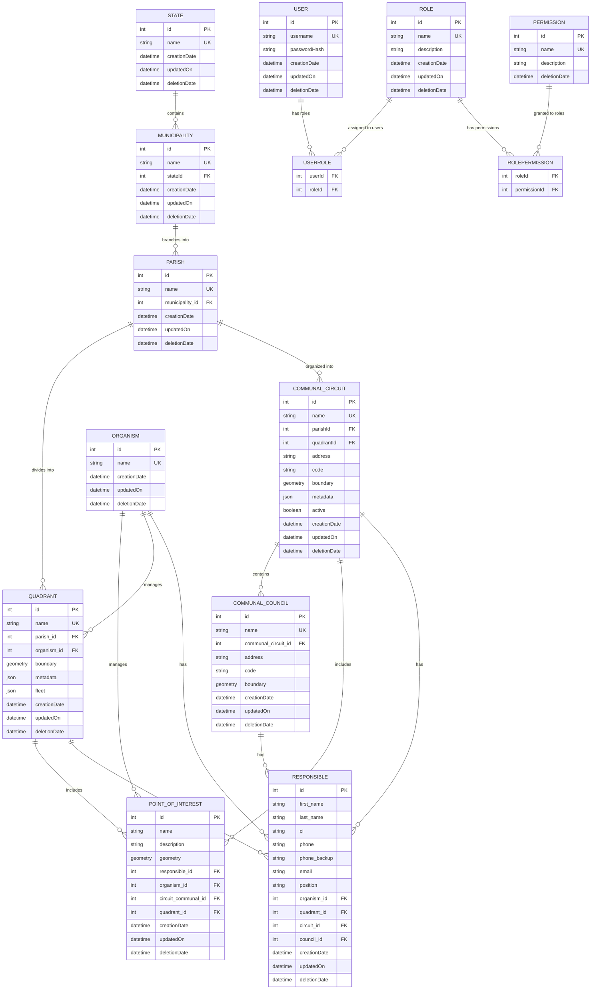

# Sistema de Administración Geoespacial – Backend

## Descripción General

Este backend es un sistema integral de administración geoespacial construido con **Node.js**, **Express**, **TypeScript** y **Sequelize ORM**. Gestiona divisiones administrativas geográficas jerárquicas (Estados → Municipios → Parroquias) y sus subdivisiones espaciales (Cuadrantes y Circuitos Comunales), junto con Puntos de Interés que pueden asociarse espacialmente con estas entidades. El sistema está diseñado para trabajar perfectamente con **Leaflet** para visualización interactiva de mapas e interacción con datos geoespaciales. Incluye control de acceso basado en roles (RBAC), autenticación JWT y registro de auditoría integral.

### Características Principales

- **Operaciones CRUD Completas** para entidades geográficas (estados, municipios, parroquias, cuadrantes, circuitos comunales, consejos comunales, puntos de interés), usuarios, roles y permisos
- **Gestión de Datos Espaciales** con límites de geometría e indexación espacial optimizada para integración con Leaflet
- **Salida GeoJSON Compatible con Leaflet** para visualización de mapas sin problemas
- **Asociación Espacial Automática** de Puntos de Interés con Cuadrantes y Circuitos Comunales basada en coordenadas
- **Control de Acceso Basado en Roles (RBAC)** con permisos generados automáticamente
- **Autenticación JWT** con hash de contraseñas bcrypt
- **Registro de Auditoría Integral** con seguimiento de cambios a nivel de campo
- **Soporte Multi-Base de Datos** (PostgreSQL/SQLite)
- **API RESTful** con paginación, filtrado y ordenamiento
- **TypeScript** para seguridad de tipos y mejor experiencia de desarrollo

### Stack Tecnológico

**Dependencias Principales:**

- **Node.js** con framework **Express**
- **TypeScript** para seguridad de tipos
- **Sequelize** con **sequelize-typescript** para ORM
- **PostgreSQL** con **PostGIS** (producción) / **SQLite** (pruebas)
- **JWT** para autenticación
- **bcrypt** para hash de contraseñas
- **CORS** para compartir recursos entre orígenes

**Integración Geoespacial:**

- **PostGIS** para operaciones de base de datos espaciales
- Soporte de formato **GeoJSON** para compatibilidad con Leaflet
- **Indexación espacial** para consultas de datos de mapas optimizadas

**Herramientas de Desarrollo:**

- **ESLint** con soporte para TypeScript
- **Prettier** para formateo de código
- **ts-node-dev** para recarga en caliente durante desarrollo
- **Supertest** para pruebas de API

## Instalación y Configuración

### Prerrequisitos

- **Node.js** (v16 o superior)
- Gestor de paquetes **Yarn**
- **PostgreSQL** (para producción) o **SQLite** (para pruebas)
- Archivo **KML** con los datos de cudrantes y circuitos comunales a cargar

### Variables de Entorno

Crea un archivo `.env` en el directorio backend con las siguientes variables:

```env
# Configuración de Base de Datos
DB_DIALECT=postgres          # o 'sqlite' para pruebas
DB_HOST=localhost
DB_PORT=5432
DB_NAME=geospatial_admin
DB_USER=tu_usuario
DB_PASSWORD=tu_contraseña
DB_STORAGE=:memory:          # Solo para pruebas SQLite

# Configuración JWT
JWT_SECRET=tu-clave-jwt-super-secreta
JWT_EXPIRE_TIME=1h           # Tiempo de expiración del token

# Configuración del Servidor
PORT=4000
BASE_URL=localhost
CORS_ORIGIN=http://localhost:3000

# Entorno
NODE_ENV=development         # o 'production' o 'test'
```

### Pasos de Instalación

1. **Instalar dependencias:**

   ```bash
   yarn install
   ```

2. **Configurar tu base de datos** (PostgreSQL para producción)

3. **Poblar la base de datos con usuario administrador y permisos:**

   ```bash
   yarn db:populate
   ```

4. **Poblar la base de datos con los datos de cuadrantes y circuitos comunales:**

   ```bash
   yarn db:geojson
   ```

5. **Iniciar el servidor de desarrollo:**
   ```bash
   yarn dev
   ```

El servidor se iniciará en `http://localhost:4000` (o tu PORT configurado).

## Scripts Disponibles

- **`yarn dev`** - Iniciar servidor de desarrollo con recarga en caliente usando ts-node-dev
- **`yarn start`** - Iniciar servidor de producción
- **`yarn db:populate`** - Sembrar base de datos con usuario administrador y todos los permisos
- **`yarn db:clear`** - Limpiar todos los datos de la base de datos
- **`yanr db:geojson`** - Sembrar base de datos con datos de coordenadas de cuadrantes y circuitos comunales
- **`yarn test`** - Ejecutar suite de pruebas Jest con salida detallada
- **`yarn lint`** - Ejecutar ESLint con auto-corrección para archivos TypeScript

## Modelos de Base de Datos y Esquema

### Modelos Principales

#### **Usuario (User)**

- `id`: entero, PK, auto-incremento
- `username`: cadena, requerido, único
- `passwordHash`: cadena, requerido (hash bcrypt, excluido de consultas por defecto)
- `creationDate`: fecha-hora, automático
- `updatedOn`: fecha-hora, automático
- `deletionDate`: fecha-hora, nullable (eliminación suave)
- **Relaciones**: Muchos-a-muchos con Rol vía UserRole
- **Hooks**: Hash de contraseña antes de guardar

#### **Rol (Role)**

- `id`: entero, PK, auto-incremento
- `name`: cadena, requerido, único
- `description`: cadena, opcional
- `creationDate`: fecha-hora, automático
- `updatedOn`: fecha-hora, automático
- `deletionDate`: fecha-hora, nullable (eliminación suave)
- **Relaciones**: Muchos-a-muchos con Usuario y Permiso
- **Hooks**: Previene eliminación si hay usuarios asignados

#### **Permiso (Permission)**

- `id`: entero, PK, auto-incremento
- `name`: cadena, requerido, único
- `description`: cadena, requerido
- `deletionDate`: fecha-hora, nullable (eliminación suave)
- **Relaciones**: Muchos-a-muchos con Rol vía RolePermission
- **Auto-Generados**: Permisos para entidades (crear/obtener/editar/eliminar para cada entidad)

#### **Estado (State)**

- `id`: entero, PK, auto-incremento
- `name`: cadena, requerido, único
- `creationDate`: fecha-hora, automático
- `updatedOn`: fecha-hora, automático
- `deletionDate`: fecha-hora, nullable (eliminación suave)
- **Relaciones**: Tiene muchos Municipios
- **Hooks**: Previene eliminación si hay municipios asignados

#### **Municipio (Municipality)**

- `id`: entero, PK, auto-incremento
- `name`: cadena, requerido, único
- `stateId`: FK a Estado, requerido
- `creationDate`: fecha-hora, automático
- `updatedOn`: fecha-hora, automático
- `deletionDate`: fecha-hora, nullable (eliminación suave)
- **Relaciones**: Pertenece a Estado, tiene muchas Parroquias
- **Hooks**: Previene eliminación si hay parroquias asignadas

#### **Parroquia (Parish)**

- `id`: entero, PK, auto-incremento
- `name`: cadena, requerido, único
- `municipalityId`: FK a Municipio, requerido
- `creationDate`: fecha-hora, automático
- `updatedOn`: fecha-hora, automático
- `deletionDate`: fecha-hora, nullable (eliminación suave)
- **Relaciones**: Pertenece a Municipio, tiene muchos Cuadrantes y Circuitos Comunales
- **Hooks**: Previene eliminación si hay cuadrantes o circuitos asignados

#### **Cuadrante (Quadrant)**

- `id`: entero, PK, auto-incremento
- `name`: cadena, requerido, único
- `parishId`: FK a Parroquia, opcional
- `organismId`: FK a Organismo, opcional
- `boundary`: geometría(Polígono), requerido (datos espaciales que definen los límites del cuadrante, debe ser un polígono)
- `metadata`: JSON, opcional (información adicional del cuadrante)
- `fleet`: JSON, requerido (datos de gestión de flota con estructura abajo)
  - `small`: objeto con `active` (entero, por defecto 0, no negativo) e `inactive` (entero, por defecto 0, no negativo)
  - `big`: objeto con `active` (entero, por defecto 0, no negativo) e `inactive` (entero, por defecto 0, no negativo)
  - `bike`: objeto con `active` (entero, por defecto 0, no negativo) e `inactive` (entero, por defecto 0, no negativo)
- `active`: booleando, valor por defecto **false** (Indica si el cuadrante fue actualizado con el resto de datos)
- `creationDate`: fecha-hora, automático
- `updatedOn`: fecha-hora, automático
- `deletionDate`: fecha-hora, nullable (eliminación suave)
- **Relaciones**: Pertenece a Parroquia, pertenece a Organismo, tiene muchos Puntos de Interés, tiene muchos Responsables, tiene un circuito comunal
- **Índice Espacial**: Recomendado en el campo boundary para rendimiento
- **Validación**: Los números de flota deben ser enteros no negativos, boundary debe ser un polígono válido

#### **Circuito Comunal (Communal Circuit)**

- `id`: entero, PK, auto-incremento
- `name`: cadena, requerido, único
- `parishId`: FK a Parroquia, opcional
- `quadrantId`: FK a Cuadrante, requerido
- `address`: cadena, requerido (dirección de oficina, diferente de la geometría)
- `code`: cadena, requerido (código de identificación del circuito)
- `boundary`: geometría(Polígono), requerido (datos espaciales que definen los límites del circuito, debe ser un polígono)
- `metadata`: JSON, opcional (información adicional del circuito)
- `active`: booleando, valor por defecto **false** (Indica si el circuito comunal fue actualizado con el resto de datos)
- `creationDate`: fecha-hora, automático
- `updatedOn`: fecha-hora, automático
- `deletionDate`: fecha-hora, nullable (eliminación suave)
- **Relaciones**: Pertenece a Parroquia, pertenece a quadrante, tiene muchos Puntos de Interés, tiene muchos Responsables, tiene muchos Consejos Comunales
- **Índice Espacial**: Recomendado en el campo boundary para rendimiento
- **Validación**: Boundary debe ser un polígono válido

#### **Consejo Comunal (Communal Council)**

- `id`: entero, PK, auto-incremento
- `name`: cadena, requerido, único
- `communalCircuitId`: FK a Circuito Comunal, requerido
- `address`: cadena, requerido (dirección de oficina del consejo)
- `code`: cadena, requerido (código de identificación del consejo)
- `boundary`: geometría(Polígono), requerido (datos espaciales que definen los límites del consejo, debe ser un polígono)
- `creationDate`: fecha-hora, automático
- `updatedOn`: fecha-hora, automático
- `deletionDate`: fecha-hora, nullable (eliminación suave)
- **Relaciones**: Pertenece a Circuito Comunal, tiene muchos Responsables
- **Hooks**: Previene eliminación si hay responsables asignados
- **Validación**: Boundary debe ser un polígono válido

#### **Punto de Interés (Point of Interest)**

- `id`: entero, PK, auto-incremento
- `name`: cadena, requerido
- `description`: cadena, opcional
- `geometry`: geometría(Punto), requerido (datos espaciales que definen la ubicación del punto)
- `organismId`: FK a Organismo
- `responsibleId`: FK a Responsable
- `communalCircuitId`: FK a Circuito Comunal, opcional (auto-asignado basado en coordenadas)
- `quadrantId`: FK a Cuadrante, opcional (auto-asignado basado en coordenadas)
- `creationDate`: fecha-hora, automático
- `updatedOn`: fecha-hora, automático
- `deletionDate`: fecha-hora, nullable (eliminación suave)
- **Relaciones**: Pertenece a Cuadrante (opcional), Circuito Comunal (opcional), Organismo (obligatorio) y Responsable (obligatorio)
- **Lógica de Negocio**: Automáticamente asociado con Cuadrante y/o Circuito Comunal si las coordenadas caen dentro de sus límites
- **Hooks**: Lógica de asociación espacial en crear/actualizar
- **Validación**: Geometry debe ser un punto válido

#### **Organismo (Organism)**

- `id`: entero, PK, auto-incremento
- `name`: cadena, requerido, único
- `icono`: cadena, opcional
- `creationDate`: fecha-hora, automático
- `updatedOn`: fecha-hora, automático
- `deletionDate`: fecha-hora, nullable (eliminación suave)
- **Relaciones**: Tiene muchos Puntos de Interés, tiene muchos Responsables, tiene muchos cuadrantes
- **Hooks**: Previene eliminación si hay puntos de interés, cuadrantes o responsables asignados

#### **Responsable (Responsible)**

- `id`: entero, PK, auto-incremento
- `firstName`: cadena, requerido
- `lastName`: cadena, requerido
- `ci`: cadena, requerido (formato de cédula venezolana: letra mayúscula seguida de números)
- `phone`: cadena, requerido (validación de formato de número telefónico venezolano)
- `phoneBackup`: cadena, opcional (validación de formato de número telefónico venezolano)
- `email`: cadena, opcional (validación de formato de email)
- `position`: cadena, requerido
- `organismId`: FK a Organismo, opcional
- `quadrantId`: FK a Cuadrante, opcional
- `communalCircuitId`: FK a Circuito Comunal, opcional
- `communalCouncilId`: FK a Consejo Comunal, opcional
- `creationDate`: fecha-hora, automático
- `updatedOn`: fecha-hora, automático
- `deletionDate`: fecha-hora, nullable (eliminación suave)
- **Relaciones**: Pertenece a Organismo (opcional), Cuadrante (opcional), Circuito Comunal (opcional), Consejo Comunal (opcional), tiene puntos de interes
- **Validación**:
  - Los números de teléfono deben coincidir con el formato venezolano (regex: `^0[24]\d{2}-\d{7}$` para fijos o `^04(12|14|16|22|24|26)-\d{7}$` para móviles)
  - La cédula debe comenzar con letra mayúscula seguida de números
  - El email debe tener formato válido si se proporciona
- **Hooks**: Registro automático de cambios en todas las operaciones

### Modelos de Unión (Muchos-a-Muchos)

#### **UsuarioRol (UserRole)**

- `userId`: FK a Usuario
- `roleId`: FK a Rol
- **Hooks**: Registro automático de enlace/desenlace para rastro de auditoría

#### **RolPermiso (RolePermission)**

- `roleId`: FK a Rol
- `permissionId`: FK a Permiso
- **Hooks**: Registro automático de enlace/desenlace para rastro de auditoría

### Relaciones de Entidades



**Detalles de Relaciones:**

- **Usuario** ↔ **Rol** (muchos-a-muchos vía tabla de unión UserRole)
- **Rol** ↔ **Permiso** (muchos-a-muchos vía tabla de unión RolePermission)
- **Estado** → **Municipio** (uno-a-muchos - estados contienen múltiples municipios)
- **Municipio** → **Parroquia** (uno-a-muchos - municipios se ramifican en múltiples parroquias)
- **Parroquia** → **Cuadrante** (uno-a-muchos - parroquias se dividen en múltiples cuadrantes)
- **Parroquia** → **Circuito Comunal** (uno-a-muchos - parroquias se organizan en múltiples circuitos comunales)
- **Circuito Comunal** → **Consejo Comunal** (uno-a-muchos - circuitos contienen múltiples consejos)
- **Organismo** → **Cuadrante** (uno-a-muchos - organismos gestionan múltiples cuadrantes)
- **Cuadrante** → **Punto de Interés** (uno-a-muchos, opcional - puntos pueden estar dentro de límites de cuadrante)
- **Circuito Comunal** → **Punto de Interés** (uno-a-muchos, opcional - puntos pueden estar dentro de límites de circuito)
- **Organismo** → **Punto de Interés** (uno-a-muchos, opcional - organismos pueden gestionar múltiples puntos de interés)
- **Organismo** → **Responsable** (uno-a-muchos, opcional - organismos pueden tener múltiples personas responsables)
- **Cuadrante** → **Responsable** (uno-a-muchos, opcional - cuadrantes pueden tener múltiples personas responsables)
- **Circuito Comunal** → **Responsable** (uno-a-muchos, opcional - circuitos pueden tener múltiples personas responsables)
- **Consejo Comunal** → **Responsable** (uno-a-muchos, opcional - consejos pueden tener múltiples personas responsables)

**Relaciones Espaciales:**

- Los Puntos de Interés se asocian automáticamente con Cuadrantes y Circuitos Comunales basándose en la inclusión de coordenadas dentro de sus geometrías de límites
- Los índices espaciales en campos de límites optimizan el rendimiento de consultas espaciales

## Estructura del Dashboard

El sistema ahora cuenta con una estructura de dashboard jerárquica:

### **Dashboard Principal**

Centro de control con vista general y navegación a dashboards especializados

### **Dashboard Administrativo**

- Gestión de usuarios
- Gestión de roles y permisos
- Administración del sistema

### **Dashboard Geográfico**

- Gestión de estados
- Gestión de municipios
- Gestión de parroquias
- Gestión de cuadrantes
- Gestión de circuitos comunales
- Gestión de consejos comunales

### **Dashboard Espacial**

- Interfaz de edición de mapas
- Gestión de límites
- Análisis y reportes espaciales
- Gestión de puntos de interés

Cada categoría de dashboard proporciona herramientas e interfaces enfocadas para gestionar entidades relacionadas, mejorando la experiencia del usuario y la organización del sistema.

## Autenticación y Autorización

### Autenticación JWT

- **Generación de Tokens**: Tokens JWT con expiración configurable (por defecto: 1h)
- **Seguridad de Contraseñas**: Hash bcrypt con rondas de sal (por defecto: 10)
- **Validación de Tokens**: Middleware valida tokens en rutas protegidas
- **Contexto de Usuario**: ID de usuario autenticado disponible en `req.userId`

### Control de Acceso Basado en Roles (RBAC)

- **Permisos Auto-Generados**: 4 acciones × múltiples entidades
  - Acciones: `create`, `get`, `edit`, `delete`
  - Entidades: `state`, `municipality`, `parish`, `quadrant`, `communal_circuit`, `communal_council`, `point_of_interest`, `organism`, `responsible`, `permission`, `role`, `user`
- **Rol de Administrador**: Creado automáticamente con todos los permisos
- **Usuario Administrador**: Credenciales por defecto (username: `admin`, password: `admin`)

### Rutas Protegidas

Todas las rutas excepto `/api/auth/*` requieren token JWT válido en el header Authorization:

```
Authorization: Bearer <tu-token-jwt>
```

## Endpoints de API

### Rutas de Autenticación (`/api/auth`)

- **`POST /api/auth/login`** - Inicio de sesión de usuario con username/password
- **`GET /api/auth/validate`** - Validar token JWT
- **`GET /api/auth/me`** - Obtener información del usuario actual con roles y permisos

### Rutas Protegidas (Requieren Autenticación)

#### **Gestión de Usuarios**

- **`/api/users`** - Gestión de usuarios (operaciones CRUD)
- **`/api/roles`** - Gestión de roles con asignación de permisos
- **`/api/permissions`** - Listado y gestión de permisos

#### **Entidades Geográficas**

##### **Estados**

- **`GET /api/states`** - Listar todos los estados con paginación y filtrado
- **`POST /api/states`** - Crear un nuevo estado
- **`GET /api/states/:id`** - Obtener detalles específicos del estado
- **`PUT /api/states/:id`** - Actualizar un estado
- **`DELETE /api/states/:id`** - Eliminar un estado (eliminación suave)

##### **Municipios**

- **`GET /api/municipalities`** - Listar municipios con relaciones de estado
- **`POST /api/municipalities`** - Crear un nuevo municipio
- **`GET /api/municipalities/:id`** - Obtener detalles específicos del municipio
- **`PUT /api/municipalities/:id`** - Actualizar un municipio
- **`DELETE /api/municipalities/:id`** - Eliminar un municipio (eliminación suave)

##### **Parroquias**

- **`GET /api/parishes`** - Listar parroquias con relaciones de municipio
- **`POST /api/parishes`** - Crear una nueva parroquia
- **`GET /api/parishes/:id`** - Obtener detalles específicos de la parroquia
- **`PUT /api/parishes/:id`** - Actualizar una parroquia
- **`DELETE /api/parishes/:id`** - Eliminar una parroquia (eliminación suave)

##### **Cuadrantes**

- **`GET /api/quadrants`** - Listar cuadrantes con datos de límites espaciales (formato GeoJSON para Leaflet)
- **`GET /api/quadrants/geojson`** - Obtener todos los cuadrantes como GeoJSON FeatureCollection para consumo directo de Leaflet
- **`POST /api/quadrants`** - Crear un nuevo cuadrante (acepta geometría GeoJSON, procesa con indexación espacial)
- **`GET /api/quadrants/:id`** - Obtener detalles específicos del cuadrante incluyendo límites como GeoJSON
- **`GET /api/quadrants/:id/geojson`** - Obtener cuadrante específico como GeoJSON Feature
- **`PUT /api/quadrants/:id`** - Actualizar un cuadrante (acepta geometría GeoJSON para modificaciones de límites)
- **`DELETE /api/quadrants/:id`** - Eliminar un cuadrante (eliminación suave)

##### **Circuitos Comunales**

- **`GET /api/communal-circuits`** - Listar circuitos comunales con datos de límites espaciales (formato GeoJSON para Leaflet)
- **`GET /api/communal-circuits/geojson`** - Obtener todos los circuitos como GeoJSON FeatureCollection para consumo directo de Leaflet
- **`POST /api/communal-circuits`** - Crear un nuevo circuito comunal (acepta geometría GeoJSON)
- **`GET /api/communal-circuits/:id`** - Obtener detalles específicos del circuito incluyendo límites como GeoJSON
- **`GET /api/communal-circuits/:id/geojson`** - Obtener circuito específico como GeoJSON Feature
- **`PUT /api/communal-circuits/:id`** - Actualizar un circuito comunal (acepta geometría GeoJSON para modificaciones de límites)
- **`DELETE /api/communal-circuits/:id`** - Eliminar un circuito comunal (eliminación suave)

##### **Consejos Comunales**

- **`GET /api/communal-councils`** - Listar todos los consejos comunales con paginación y filtrado
- **`POST /api/communal-councils`** - Crear un nuevo consejo comunal
- **`GET /api/communal-councils/:id`** - Obtener detalles específicos del consejo con responsables asociados
- **`PUT /api/communal-councils/:id`** - Actualizar un consejo comunal
- **`DELETE /api/communal-councils/:id`** - Eliminar un consejo comunal (eliminación suave)

##### **Puntos de Interés**

- **`GET /api/points-of-interest`** - Listar puntos con opciones de filtrado espacial (por cuadrante/circuito, caja delimitadora)
- **`GET /api/points-of-interest/geojson`** - Obtener todos los puntos como GeoJSON FeatureCollection para marcadores de Leaflet
- **`GET /api/points-of-interest/within/:bounds`** - Obtener puntos dentro de los límites del viewport del mapa para carga dinámica
- **`POST /api/points-of-interest`** - Crear un nuevo punto (acepta lat/lng, asigna automáticamente a cuadrante/circuito)
- **`GET /api/points-of-interest/:id`** - Obtener detalles específicos del punto con asociaciones espaciales
- **`GET /api/points-of-interest/:id/geojson`** - Obtener punto específico como GeoJSON Feature
- **`PUT /api/points-of-interest/:id`** - Actualizar un punto (re-evalúa asociaciones espaciales si cambian las coordenadas)
- **`DELETE /api/points-of-interest/:id`** - Eliminar un punto de interés (eliminación suave)

##### **Organismos**

- **`GET /api/organisms`** - Listar todos los organismos con paginación y filtrado
- **`POST /api/organisms`** - Crear un nuevo organismo
- **`GET /api/organisms/:id`** - Obtener detalles específicos del organismo con puntos de interés y responsables asociados
- **`PUT /api/organisms/:id`** - Actualizar un organismo
- **`DELETE /api/organisms/:id`** - Eliminar un organismo (eliminación suave)

##### **Responsables**

- **`GET /api/responsibles`** - Listar responsables con relaciones de entidades y filtrado
- **`POST /api/responsibles`** - Crear un nuevo responsable (valida formato de número telefónico venezolano y cédula)
- **`GET /api/responsibles/:id`** - Obtener detalles específicos del responsable
- **`PUT /api/responsibles/:id`** - Actualizar un responsable (valida formato de número telefónico y cédula)
- **`DELETE /api/responsibles/:id`** - Eliminar un responsable (eliminación suave)

### Características Comunes

- **Paginación**: `?page=1&pageSize=10`
- **Filtrado**: Filtros específicos de entidad (ej., `?name=buscar&parish=centro`)
- **Filtrado Espacial**: Consultas de caja delimitadora (`?bbox=minLng,minLat,maxLng,maxLat`) para optimización del viewport del mapa
- **Ordenamiento**: `?sortBy=name&sortOrder=ASC`
- **Salida GeoJSON**: Todos los endpoints espaciales soportan formato GeoJSON para integración directa con Leaflet
- **Manejo de Errores**: Respuestas de error JSON consistentes
- **Validación**: Validación del cuerpo de la petición con mensajes de error detallados incluyendo validación de datos espaciales

## Configuración de Base de Datos

### Soporte Multi-Base de Datos

- **PostgreSQL con PostGIS**: Base de datos de producción con soporte JSONB y datos espaciales (extensión PostGIS requerida)
- **SQLite**: Base de datos de pruebas con opción en memoria
- **Basado en Entorno**: Configuración automática vía variables de entorno

### Operaciones de Base de Datos

- **Auto-Sync**: Sequelize automáticamente crea/actualiza tablas con columnas espaciales
- **Eliminaciones Suaves**: La mayoría de entidades usan `deletionDate` para eliminación suave
- **Restricciones**: Restricciones de clave foránea con políticas CASCADE/RESTRICT
- **Índices**: Indexación automática en claves primarias, claves foráneas y límites espaciales (índices GIST para geometría)
- **Soporte Espacial**:
  - Columnas de geometría con indexación espacial para rendimiento óptimo de consultas de mapas
  - Serialización/deserialización GeoJSON para compatibilidad con Leaflet
  - Consultas de relaciones espaciales (ST_Contains, ST_Within, ST_Intersects)
  - Consultas de caja delimitadora optimizadas para carga del viewport del mapa

## Herramientas de Desarrollo

### Calidad de Código

- **TypeScript**: Verificación estricta de tipos con definiciones de tipos personalizadas
- **ESLint**: Linting con reglas de TypeScript y auto-corrección
- **Prettier**: Formateo de código con estilo consistente
- **Ordenamiento de Imports**: Organización automática de imports

### Experiencia de Desarrollo

- **Recarga en Caliente**: ts-node-dev para reinicio instantáneo del servidor en cambios
- **Mapeo de Rutas**: Alias de rutas TypeScript para imports limpios
- **Definiciones de Tipos**: Tipos personalizados para extensiones de Express, Sequelize
- **Manejo de Errores**: Tipos de error y mensajes comprensivos

## Características de Seguridad

### Seguridad de Autenticación

- **Hash bcrypt**: Almacenamiento seguro de contraseñas con rondas de sal configurables
- **Tokens JWT**: Autenticación sin estado con expiración configurable
- **Validación de Tokens**: Middleware valida tokens en cada petición protegida

### Seguridad de Datos

- **Validación de Entrada**: Validación de modelo Sequelize y validadores personalizados
- **Protección contra Inyección SQL**: Consultas parametrizadas vía Sequelize ORM
- **Configuración CORS**: Compartir recursos entre orígenes configurable
- **Variables de Entorno**: Datos sensibles almacenados en variables de entorno

### Control de Acceso

- **Permisos Basados en Roles**: Sistema de permisos granular
- **Protección de Rutas**: Middleware de autenticación en todas las rutas protegidas
- **Contexto de Usuario**: Usuario autenticado disponible durante todo el ciclo de vida de la petición

## Manejo de Errores

### Errores de Validación

- **Nivel de Modelo**: Decoradores Sequelize para validación de campos
- **Nivel de Controlador**: Validación de lógica de negocio con mensajes detallados
- **Nivel de Petición**: Validación de entrada para endpoints de API

### Formato de Respuesta de Error

```json
{
  "error": "Mensaje de error detallado",
  "code": "CODIGO_ERROR",
  "details": {
    "field": "Contexto adicional"
  }
}
```

### Soporte de Transacciones

- **Integridad de Datos**: Operaciones críticas envueltas en transacciones de base de datos
- **Rollback**: Rollback automático en errores
- **Consistencia de Auditoría**: Logs de cambios creados dentro de la misma transacción

## Cuenta de Administrador por Defecto

Después de ejecutar `yarn db:populate`, puedes iniciar sesión con:

- **Username**: `admin`
- **Password**: `admin`

**⚠️ Importante**: ¡Cambia la contraseña del administrador inmediatamente en producción!

## Licencia

Licencia MIT - ver package.json para detalles.

---

## Contribuir

1. Haz fork del repositorio
2. Crea una rama de característica
3. Haz tus cambios con pruebas
4. Ejecuta `yarn lint` y `yarn test`
5. Envía un pull request

Para preguntas o problemas, por favor crea un issue en el repositorio.
