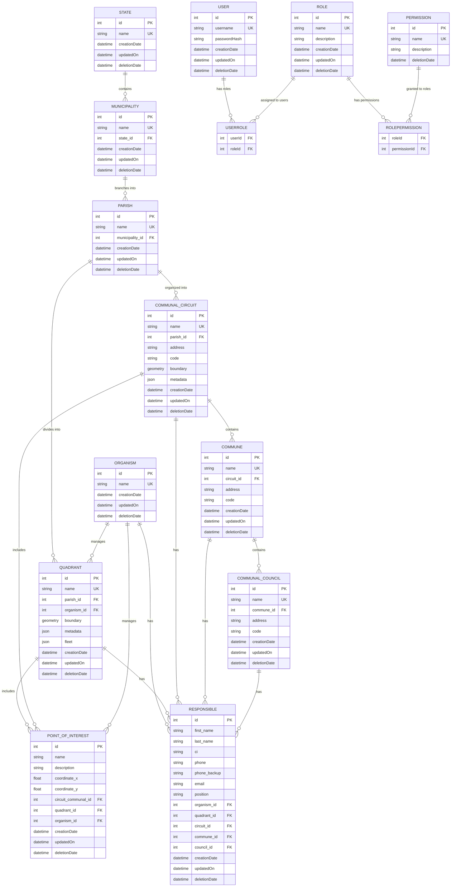

# Geospatial Administration System – Backend

## Overview

This backend is a comprehensive geospatial administration system built with **Node.js**, **Express**, **TypeScript**, and **Sequelize ORM**. It manages hierarchical geographical administrative divisions (States → Municipalities → Parishes) and their spatial subdivisions (Quadrants and Communal Circuits), along with Points of Interest that can be spatially associated with these entities. The system is designed to work seamlessly with **Leaflet** for interactive map visualization and geospatial data interaction. It features role-based access control (RBAC), JWT authentication, and comprehensive audit logging.

### Key Features

- **Complete CRUD Operations** for geographical entities (states, municipalities, parishes, quadrants, communal circuits, points of interest), users, roles, and permissions
- **Spatial Data Management** with geometry boundaries and spatial indexing optimized for Leaflet integration
- **Leaflet-Compatible GeoJSON Output** for seamless map visualization
- **Automatic Spatial Association** of Points of Interest with Quadrants and Communal Circuits based on coordinates
- **Role-Based Access Control (RBAC)** with auto-generated permissions
- **JWT Authentication** with bcrypt password hashing
- **Comprehensive Audit Logging** with field-level change tracking
- **Multi-Database Support** (PostgreSQL/SQLite)
- **RESTful API** with pagination, filtering, and sorting
- **TypeScript** for type safety and better development experience

### Technology Stack

**Core Dependencies:**

- **Node.js** with **Express** framework
- **TypeScript** for type safety
- **Sequelize** with **sequelize-typescript** for ORM
- **PostgreSQL** with **PostGIS** (production) / **SQLite** (testing)
- **JWT** for authentication
- **bcrypt** for password hashing
- **CORS** for cross-origin resource sharing

**Geospatial Integration:**

- **PostGIS** for spatial database operations
- **GeoJSON** format support for Leaflet compatibility
- **Spatial indexing** for optimized map data queries

**Development Tools:**

- **ESLint** with TypeScript support
- **Prettier** for code formatting
- **ts-node-dev** for development hot reload
- **Supertest** for API testing

## Installation & Setup

### Prerequisites

- **Node.js** (v16 or higher)
- **Yarn** package manager
- **PostgreSQL** (for production) or **SQLite** (for testing)

### Environment Variables

Create a `.env` file in the backend directory with the following variables:

```env
# Database Configuration
DB_DIALECT=postgres          # or 'sqlite' for testing
DB_HOST=localhost
DB_PORT=5432
DB_NAME=geospatial_admin
DB_USER=your_username
DB_PASSWORD=your_password
DB_STORAGE=:memory:          # Only for SQLite testing

# JWT Configuration
JWT_SECRET=your-super-secret-jwt-key
JWT_EXPIRE_TIME=1h           # Token expiration time

# Server Configuration
PORT=4000
BASE_URL=localhost
CORS_ORIGIN=http://localhost:3000

# Environment
NODE_ENV=development         # or 'production' or 'test'
```

### Installation Steps

1. **Install dependencies:**

   ```bash
   yarn install
   ```

2. **Set up your database** (PostgreSQL for production)

3. **Populate the database with admin user and permissions:**

   ```bash
   yarn db:populate
   ```

4. **Start the development server:**
   ```bash
   yarn dev
   ```

The server will start at `http://localhost:4000` (or your configured PORT).

## Available Scripts

- **`yarn dev`** - Start development server with hot reload using ts-node-dev
- **`yarn start`** - Start production server
- **`yarn db:populate`** - Seed database with admin user and all permissions
- **`yarn db:clear`** - Clear all data from the database
- **`yarn test`** - Run Jest test suite with verbose output
- **`yarn lint`** - Run ESLint with auto-fix for TypeScript files

## Database Models & Schema

### Main Models

#### **User**

- `id`: integer, PK, auto-increment
- `username`: string, required, unique
- `passwordHash`: string, required (bcrypt hashed, excluded from queries by default)
- `creationDate`: datetime, auto
- `updatedOn`: datetime, auto
- `deletionDate`: datetime, nullable (soft delete)
- **Relationships**: Many-to-many with Role via UserRole
- **Hooks**: Password hashing before save

#### **Role**

- `id`: integer, PK, auto-increment
- `name`: string, required, unique
- `description`: string, optional
- `creationDate`: datetime, auto
- `updatedOn`: datetime, auto
- `deletionDate`: datetime, nullable (soft delete)
- **Relationships**: Many-to-many with User and Permission
- **Hooks**: Prevents deletion if users are assigned

#### **Permission**

- `id`: integer, PK, auto-increment
- `name`: string, required, unique
- `description`: string, required
- `deletionDate`: datetime, nullable (soft delete)
- **Relationships**: Many-to-many with Role via RolePermission
- **Auto-Generated**: Permissions for entities (create/get/edit/delete for each entity)

#### **State**

- `id`: integer, PK, auto-increment
- `name`: string, required, unique
- `creationDate`: datetime, auto
- `updatedOn`: datetime, auto
- `deletionDate`: datetime, nullable (soft delete)
- **Relationships**: Has many Municipalities
- **Hooks**: Prevents deletion if municipalities are assigned

#### **Municipality**

- `id`: integer, PK, auto-increment
- `name`: string, required, unique
- `state_id`: FK to State, required
- `creationDate`: datetime, auto
- `updatedOn`: datetime, auto
- `deletionDate`: datetime, nullable (soft delete)
- **Relationships**: Belongs to State, has many Parishes
- **Hooks**: Prevents deletion if parishes are assigned

#### **Parish**

- `id`: integer, PK, auto-increment
- `name`: string, required, unique
- `municipality_id`: FK to Municipality, required
- `creationDate`: datetime, auto
- `updatedOn`: datetime, auto
- `deletionDate`: datetime, nullable (soft delete)
- **Relationships**: Belongs to Municipality, has many Quadrants and Communal Circuits
- **Hooks**: Prevents deletion if quadrants or circuits are assigned

#### **Quadrant**

- `id`: integer, PK, auto-increment
- `name`: string, required, unique
- `parish_id`: FK to Parish, required
- `organism_id`: FK to Organism, required
- `boundary`: geometry, required (spatial data defining the quadrant boundaries)
- `metadata`: JSON, optional (additional quadrant information)
- `fleet`: JSON, required (fleet management data with structure below)
  - `small`: object with `active` (integer, default 0, non-negative) and `inactive` (integer, default 0, non-negative)
  - `big`: object with `active` (integer, default 0, non-negative) and `inactive` (integer, default 0, non-negative)
  - `bike`: object with `active` (integer, default 0, non-negative) and `inactive` (integer, default 0, non-negative)
- `creationDate`: datetime, auto
- `updatedOn`: datetime, auto
- `deletionDate`: datetime, nullable (soft delete)
- **Relationships**: Belongs to Parish, belongs to Organism, has many Points of Interest, has many Responsibles
- **Spatial Index**: Recommended on boundary field for performance
- **Validation**: Fleet numbers must be non-negative integers

#### **Communal Circuit**

- `id`: integer, PK, auto-increment
- `name`: string, required, unique
- `parish_id`: FK to Parish, required
- `address`: string, required (office address, different from geometry)
- `code`: string, required (circuit identification code)
- `boundary`: geometry, required (spatial data defining the circuit boundaries)
- `metadata`: JSON, optional (additional circuit information)
- `creationDate`: datetime, auto
- `updatedOn`: datetime, auto
- `deletionDate`: datetime, nullable (soft delete)
- **Relationships**: Belongs to Parish, has many Points of Interest, has many Responsibles, has many Communes
- **Spatial Index**: Recommended on boundary field for performance

#### **Commune**

- `id`: integer, PK, auto-increment
- `name`: string, required, unique
- `circuit_id`: FK to Communal Circuit, required
- `address`: string, required (commune office address)
- `code`: string, required (commune identification code)
- `creationDate`: datetime, auto
- `updatedOn`: datetime, auto
- `deletionDate`: datetime, nullable (soft delete)
- **Relationships**: Belongs to Communal Circuit, has many Responsibles, has many Communal Councils
- **Hooks**: Prevents deletion if communal councils are assigned

#### **Communal Council**

- `id`: integer, PK, auto-increment
- `name`: string, required, unique
- `commune_id`: FK to Commune, required
- `address`: string, required (council office address)
- `code`: string, required (council identification code)
- `creationDate`: datetime, auto
- `updatedOn`: datetime, auto
- `deletionDate`: datetime, nullable (soft delete)
- **Relationships**: Belongs to Commune, has many Responsibles
- **Hooks**: Prevents deletion if responsibles are assigned

#### **Point of Interest**

- `id`: integer, PK, auto-increment
- `name`: string, required
- `description`: string, optional
- `coordinate_x`: float, required (longitude)
- `coordinate_y`: float, required (latitude)
- `circuit_communal_id`: FK to Communal Circuit, optional (auto-assigned based on coordinates)
- `quadrant_id`: FK to Quadrant, optional (auto-assigned based on coordinates)
- `organism_id`: FK to Organism, optional
- `creationDate`: datetime, auto
- `updatedOn`: datetime, auto
- `deletionDate`: datetime, nullable (soft delete)
- **Relationships**: Belongs to Quadrant (optional), Communal Circuit (optional), and Organism (optional)
- **Business Logic**: Automatically associated with Quadrant and/or Communal Circuit if coordinates fall within their boundaries
- **Hooks**: Spatial association logic on create/update

#### **Organism**

- `id`: integer, PK, auto-increment
- `name`: string, required, unique
- `creationDate`: datetime, auto
- `updatedOn`: datetime, auto
- `deletionDate`: datetime, nullable (soft delete)
- **Relationships**: Has many Points of Interest, has many Responsibles
- **Hooks**: Prevents deletion if points of interest or responsibles are assigned

#### **Responsible**

- `id`: integer, PK, auto-increment
- `first_name`: string, required
- `last_name`: string, required
- `ci`: string, required (Venezuelan ID format: uppercase letter followed by numbers)
- `phone`: string, required (Venezuelan phone number format validation)
- `phone_backup`: string, optional (Venezuelan phone number format validation)
- `email`: string, optional (email format validation)
- `position`: string, required
- `organism_id`: FK to Organism, optional
- `quadrant_id`: FK to Quadrant, optional
- `circuit_id`: FK to Communal Circuit, optional
- `commune_id`: FK to Commune, optional
- `council_id`: FK to Communal Council, optional
- `creationDate`: datetime, auto
- `updatedOn`: datetime, auto
- `deletionDate`: datetime, nullable (soft delete)
- **Relationships**: Belongs to Organism (optional), Quadrant (optional), Communal Circuit (optional), Commune (optional), Communal Council (optional)
- **Validation**:
  - Phone numbers must match Venezuelan format (regex: `^0[24]\d{2}-\d{7}$` for landlines or `^04(12|14|16|22|24|26)-\d{7}$` for mobile)
  - CI must start with uppercase letter followed by numbers
  - Email must be valid email format if provided
- **Hooks**: Automatic change logging on all operations

### Join Models (Many-to-Many)

#### **UserRole**

- `userId`: FK to User
- `roleId`: FK to Role
- **Hooks**: Automatic link/unlink logging for audit trail

#### **RolePermission**

- `roleId`: FK to Role
- `permissionId`: FK to Permission
- **Hooks**: Automatic link/unlink logging for audit trail

### Entity Relationships



**Relationship Details:**

- **User** ↔ **Role** (many-to-many via UserRole join table)
- **Role** ↔ **Permission** (many-to-many via RolePermission join table)
- **State** → **Municipality** (one-to-many - states contain multiple municipalities)
- **Municipality** → **Parish** (one-to-many - municipalities branch into multiple parishes)
- **Parish** → **Quadrant** (one-to-many - parishes divide into multiple quadrants)
- **Parish** → **Communal Circuit** (one-to-many - parishes organize into multiple communal circuits)
- **Communal Circuit** → **Commune** (one-to-many - circuits contain multiple communes)
- **Commune** → **Communal Council** (one-to-many - communes contain multiple councils)
- **Organism** → **Quadrant** (one-to-many - organisms manage multiple quadrants)
- **Quadrant** → **Point of Interest** (one-to-many, optional - points may be within quadrant boundaries)
- **Communal Circuit** → **Point of Interest** (one-to-many, optional - points may be within circuit boundaries)
- **Organism** → **Point of Interest** (one-to-many, optional - organisms can manage multiple points of interest)
- **Organism** → **Responsible** (one-to-many, optional - organisms can have multiple responsible persons)
- **Quadrant** → **Responsible** (one-to-many, optional - quadrants can have multiple responsible persons)
- **Communal Circuit** → **Responsible** (one-to-many, optional - circuits can have multiple responsible persons)
- **Commune** → **Responsible** (one-to-many, optional - communes can have multiple responsible persons)
- **Communal Council** → **Responsible** (one-to-many, optional - councils can have multiple responsible persons)

**Spatial Relationships:**

- Points of Interest are automatically associated with Quadrants and Communal Circuits based on coordinate inclusion within their boundary geometries
- Spatial indices on boundary fields optimize spatial query performance

## Authentication & Authorization

### JWT Authentication

- **Token Generation**: JWT tokens with configurable expiration (default: 1h)
- **Password Security**: bcrypt hashing with salt rounds (default: 10)
- **Token Validation**: Middleware validates tokens on protected routes
- **User Context**: Authenticated user ID available in `req.userId`

### Role-Based Access Control (RBAC)

- **Auto-Generated Permissions**: 4 actions × multiple entities
  - Actions: `create`, `get`, `edit`, `delete`
  - Entities: `state`, `municipality`, `parish`, `quadrant`, `communal_circuit`, `commune`, `communal_council`, `point_of_interest`, `organism`, `responsible`, `permission`, `role`, `user`
- **Admin Role**: Created automatically with all permissions
- **Admin User**: Default credentials (username: `admin`, password: `admin`)

### Protected Routes

All routes except `/api/auth/*` require valid JWT token in Authorization header:

```
Authorization: Bearer <your-jwt-token>
```

## API Endpoints

### Authentication Routes (`/api/auth`)

- **`POST /api/auth/login`** - User login with username/password
- **`GET /api/auth/validate`** - Validate JWT token
- **`GET /api/auth/me`** - Get current user information with roles and permissions

### Protected Routes (Require Authentication)

#### **User Management**

- **`/api/users`** - User management (CRUD operations)
- **`/api/roles`** - Role management with permission assignment
- **`/api/permissions`** - Permission listing and management

#### **Geographical Entities**

##### **States**

- **`GET /api/states`** - List all states with pagination and filtering
- **`POST /api/states`** - Create a new state
- **`GET /api/states/:id`** - Get specific state details
- **`PUT /api/states/:id`** - Update a state
- **`DELETE /api/states/:id`** - Delete a state (soft delete)

##### **Municipalities**

- **`GET /api/municipalities`** - List municipalities with state relationships
- **`POST /api/municipalities`** - Create a new municipality
- **`GET /api/municipalities/:id`** - Get specific municipality details
- **`PUT /api/municipalities/:id`** - Update a municipality
- **`DELETE /api/municipalities/:id`** - Delete a municipality (soft delete)

##### **Parishes**

- **`GET /api/parishes`** - List parishes with municipality relationships
- **`POST /api/parishes`** - Create a new parish
- **`GET /api/parishes/:id`** - Get specific parish details
- **`PUT /api/parishes/:id`** - Update a parish
- **`DELETE /api/parishes/:id`** - Delete a parish (soft delete)

##### **Quadrants**

- **`GET /api/quadrants`** - List quadrants with spatial boundary data (GeoJSON format for Leaflet)
- **`GET /api/quadrants/geojson`** - Get all quadrants as GeoJSON FeatureCollection for direct Leaflet consumption
- **`POST /api/quadrants`** - Create a new quadrant (accepts GeoJSON geometry, processes with spatial indexing)
- **`GET /api/quadrants/:id`** - Get specific quadrant details including boundary as GeoJSON
- **`GET /api/quadrants/:id/geojson`** - Get specific quadrant as GeoJSON Feature
- **`PUT /api/quadrants/:id`** - Update a quadrant (accepts GeoJSON geometry for boundary modifications)
- **`DELETE /api/quadrants/:id`** - Delete a quadrant (soft delete)

##### **Communal Circuits**

- **`GET /api/communal-circuits`** - List communal circuits with spatial boundary data (GeoJSON format for Leaflet)
- **`GET /api/communal-circuits/geojson`** - Get all circuits as GeoJSON FeatureCollection for direct Leaflet consumption
- **`POST /api/communal-circuits`** - Create a new communal circuit (accepts GeoJSON geometry)
- **`GET /api/communal-circuits/:id`** - Get specific circuit details including boundary as GeoJSON
- **`GET /api/communal-circuits/:id/geojson`** - Get specific circuit as GeoJSON Feature
- **`PUT /api/communal-circuits/:id`** - Update a communal circuit (accepts GeoJSON geometry for boundary modifications)
- **`DELETE /api/communal-circuits/:id`** - Delete a communal circuit (soft delete)

##### **Points of Interest**

- **`GET /api/points-of-interest`** - List points with spatial filtering options (by quadrant/circuit, bounding box)
- **`GET /api/points-of-interest/geojson`** - Get all points as GeoJSON FeatureCollection for Leaflet markers
- **`GET /api/points-of-interest/within/:bounds`** - Get points within map viewport bounds for dynamic loading
- **`POST /api/points-of-interest`** - Create a new point (accepts lat/lng, automatically assigns to quadrant/circuit)
- **`GET /api/points-of-interest/:id`** - Get specific point details with spatial associations
- **`GET /api/points-of-interest/:id/geojson`** - Get specific point as GeoJSON Feature
- **`PUT /api/points-of-interest/:id`** - Update a point (re-evaluates spatial associations if coordinates change)
- **`DELETE /api/points-of-interest/:id`** - Delete a point of interest (soft delete)

##### **Organisms**

- **`GET /api/organisms`** - List all organisms with pagination and filtering
- **`POST /api/organisms`** - Create a new organism
- **`GET /api/organisms/:id`** - Get specific organism details with associated points of interest and responsibles
- **`PUT /api/organisms/:id`** - Update an organism
- **`DELETE /api/organisms/:id`** - Delete an organism (soft delete)

##### **Communes**

- **`GET /api/communes`** - List all communes with pagination and filtering
- **`POST /api/communes`** - Create a new commune
- **`GET /api/communes/:id`** - Get specific commune details with associated responsibles and councils
- **`PUT /api/communes/:id`** - Update a commune
- **`DELETE /api/communes/:id`** - Delete a commune (soft delete)

##### **Communal Councils**

- **`GET /api/communal-councils`** - List all communal councils with pagination and filtering
- **`POST /api/communal-councils`** - Create a new communal council
- **`GET /api/communal-councils/:id`** - Get specific council details with associated responsibles
- **`PUT /api/communal-councils/:id`** - Update a communal council
- **`DELETE /api/communal-councils/:id`** - Delete a communal council (soft delete)

##### **Responsibles**

- **`GET /api/responsibles`** - List responsibles with entity relationships and filtering
- **`POST /api/responsibles`** - Create a new responsible (validates Venezuelan phone number and CI format)
- **`GET /api/responsibles/:id`** - Get specific responsible details
- **`PUT /api/responsibles/:id`** - Update a responsible (validates phone number and CI format)
- **`DELETE /api/responsibles/:id`** - Delete a responsible (soft delete)

### Common Features

- **Pagination**: `?page=1&pageSize=10`
- **Filtering**: Entity-specific filters (e.g., `?name=search&parish=downtown`)
- **Spatial Filtering**: Bounding box queries (`?bbox=minLng,minLat,maxLng,maxLat`) for map viewport optimization
- **Sorting**: `?sortBy=name&sortOrder=ASC`
- **GeoJSON Output**: All spatial endpoints support GeoJSON format for direct Leaflet integration
- **Error Handling**: Consistent JSON error responses
- **Validation**: Request body validation with detailed error messages including spatial data validation

## Database Configuration

### Multi-Database Support

- **PostgreSQL with PostGIS**: Production database with JSONB and spatial data support (PostGIS extension required)
- **SQLite**: Testing database with in-memory option
- **Environment-Based**: Automatic configuration via environment variables

### Database Operations

- **Auto-Sync**: Sequelize automatically creates/updates tables with spatial columns
- **Soft Deletes**: Most entities use `deletionDate` for soft deletion
- **Constraints**: Foreign key constraints with CASCADE/RESTRICT policies
- **Indexes**: Automatic indexing on primary keys, foreign keys, and spatial boundaries (GIST indexes for geometry)
- **Spatial Support**:
  - Geometry columns with spatial indexing for optimal map query performance
  - GeoJSON serialization/deserialization for Leaflet compatibility
  - Spatial relationship queries (ST_Contains, ST_Within, ST_Intersects)
  - Bounding box queries optimized for map viewport loading

## Development Tools

### Code Quality

- **TypeScript**: Strict type checking with custom type definitions
- **ESLint**: Linting with TypeScript rules and auto-fix
- **Prettier**: Code formatting with consistent style
- **Import Sorting**: Automatic import organization

### Development Experience

- **Hot Reload**: ts-node-dev for instant server restart on changes
- **Path Mapping**: TypeScript path aliases for clean imports
- **Type Definitions**: Custom types for Express, Sequelize extensions
- **Error Handling**: Comprehensive error types and messages

## Security Features

### Authentication Security

- **bcrypt Hashing**: Secure password storage with configurable salt rounds
- **JWT Tokens**: Stateless authentication with configurable expiration
- **Token Validation**: Middleware validates tokens on every protected request

### Data Security

- **Input Validation**: Sequelize model validation and custom validators
- **SQL Injection Protection**: Parameterized queries via Sequelize ORM
- **CORS Configuration**: Configurable cross-origin resource sharing
- **Environment Variables**: Sensitive data stored in environment variables

### Access Control

- **Role-Based Permissions**: Granular permission system
- **Route Protection**: Authentication middleware on all protected routes
- **User Context**: Authenticated user available throughout request lifecycle

## Error Handling

### Validation Errors

- **Model-Level**: Sequelize decorators for field validation
- **Controller-Level**: Business logic validation with detailed messages
- **Request-Level**: Input validation for API endpoints

### Error Response Format

```json
{
  "error": "Detailed error message",
  "code": "ERROR_CODE",
  "details": {
    "field": "Additional context"
  }
}
```

### Transaction Support

- **Data Integrity**: Critical operations wrapped in database transactions
- **Rollback**: Automatic rollback on errors
- **Audit Consistency**: Change logs created within same transaction

## Default Admin Account

After running `yarn db:populate`, you can log in with:

- **Username**: `admin`
- **Password**: `admin`

**⚠️ Important**: Change the admin password immediately in production!

## License

MIT License - see package.json for details.

---

## Contributing

1. Fork the repository
2. Create a feature branch
3. Make your changes with tests
4. Run `yarn lint` and `yarn test`
5. Submit a pull request

For questions or issues, please create an issue in the repository.
